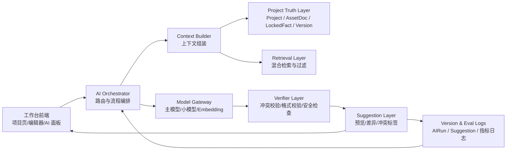

# 金手指 AI 编剧工作台 AI 技术方案

## 0. 文档信息
- 版本：v0.1
- 状态：Working draft
- 更新时间：2026-03-10
- 关联 PRD：`PRD_jinshouzhi_ai_screenwriting_workbench.md`
- 关联原型：`PrototypeSpec_jinshouzhi_ai_screenwriting_workbench.md`
- 参考材料：`tmp/pdfs/金手指AI编剧助手.txt`、`tmp/pdfs/【创意写作】笔花.txt`、`tmp/pdfs/【笔花】Prompt.txt`
- 目标评审对象：产品 / 设计 / AI 算法 / 后端 / 前端 / 测试 / 运营 / 甲方
- 文档定位：基于当前项目材料和截至 2026-03-10 已确认的产品边界，说明“金手指 AI 编剧工作台”本期应采用的 AI 技术路线、事实层设计、工作流、模型分工、评估方法与发布策略。

## 1. 执行摘要
当前产品的核心，不是做一个“会聊天的 AI 编剧”，也不是当前阶段就闭环完成版权确权和版权授权交易，而是做一个以剧本项目为中心、面向职业编剧和短剧团队的 AI 编剧工作台。用户真正要完成的任务，是围绕同一个项目持续沉淀世界观、人物、关系、大纲、分集设计、单集剧本和交付稿件；因此，AI 方案的重点不应放在单次 Prompt 生成，而应放在“项目事实如何沉淀、上下文如何被正确调用、生成结果如何可控采纳、上游变化如何影响下游”这四个核心问题上。

综合当前 PRD、原型和参考材料，推荐本期采用“固定 Workflow + Tool-using Copilot + 项目级 Retrieval + 事实锁定与校验”的总体方案。更简单的纯规则或单次 LLM 方案，无法支撑长链路创作、一致性控制和多文档协同；更复杂的开放式 Agent 方案，则会在当前阶段引入不必要的不可控性、时延和成本。换句话说，本期最合适的路径，不是让一个 Agent 自主写完整个项目，而是让 AI 在工作台中作为可见、可解释、可回滚的创作协作者，围绕不同文档和工具执行可观测的子流程。

本期 AI 技术方案的边界也需要明确。第一，本期 AI 主要服务于“项目创建/导入 -> 核心资产沉淀 -> 单集剧本生成与编辑 -> 格式化导出”的 MVP 主闭环，对应 6 组核心工具；版权交易、市场判断、对外宣传、完全自动化发布都不在本期自动执行范围内。第二，本期不建议直接上开放式 Agent、图数据库或 Fine-tuning，而应先把项目事实层、上下文编排、Suggestion 采纳、离线评估和运行日志做扎实。最大的技术风险不在“模型是否足够强”，而在“项目事实是否稳定、上下文是否正确、质量是否可评估”。

## 2. 用户任务与产品目标
当前产品面对的不是泛内容写作人群，而是职业编剧、短剧公司内容策划、编剧工作室成员和内容负责人。这类用户不是来做一次性问答，而是来推进一个需要持续数天到数周才能完成的剧本项目。他们需要的是一个能持续积累设定、能在不同文档间共享上下文、能辅助而不强替代的 AI 创作工作台。

从当前材料来看，用户的核心任务可以概括为：把一个创意、已有资料或一个模板，逐步变成可交付的短剧项目。这个过程中，AI 既要帮助用户更快启动，也要在角色命名、人物关系、世界观约束、关键冲突、节奏推进、格式输出等方面维持一致性。这里真正需要 AI 的不是“会不会写一段文案”，而是“能不能在复杂约束下持续生成对项目有用的内容”。

- 目标用户：职业编剧、短剧公司内容策划、编剧工作室成员、内容负责人
- 用户当前要完成的任务：创建或导入剧本项目，沉淀上游资产，完成单集剧本与交付稿件
- AI 介入位置：项目启动、资产生成/修订、单集剧本助手、格式化导出、一致性提醒、提示词与模板复用
- 希望提升的体验指标：启动速度、一致性、连续创作效率、AI 结果可采纳率、导出可交付性
- 本期不覆盖内容：版权确权/授权交易闭环、无人审核的自动外发、复杂团队协作、移动端优先

之所以不能只靠规则或人工流程，是因为剧本创作天然包含开放式表达、风格判断和大量模糊输入；但之所以也不能把它完全交给一个黑盒大模型，是因为项目内存在大量必须稳定遵守的硬事实，例如人物名、关系、题材、时代背景、集数规格、关键桥段和格式规则。因此，本期方案的本质是“把开放创作任务放进一个有事实层和审核层的 AI 工作流里”。

## 3. 备选方案对比
从当前产品状态出发，真正需要比较的不是“用不用大模型”，而是“把大模型放在多大的边界内使用”。由于产品已经明确是项目制工作台，并且强调 AI 可控性、版本化与采纳机制，因此架构选择必须优先考虑可观测性和事实一致性，而不是仅比较生成质量。

| 方案 | 适用条件 | 优点 | 风险 / 缺点 | 是否采用 |
| --- | --- | --- | --- | --- |
| 纯规则 / 搜索 | 输出边界固定，任务以查找、格式检查、路由为主 | 可控、便宜、可解释 | 无法完成大纲、人物、剧本等开放创作任务 | 否 |
| 单次 LLM | 上下文较短，任务独立，结果一次生成即可 | 接入快，交互简单 | 无法稳定继承项目事实，长链路质量不可控 | 否，作为局部子能力可用 |
| LLM + Retrieval | 私有知识多、上下文会变化，需要引用项目资料 | 能处理项目内知识和导入资料 | 只有检索还不够，缺少状态、采纳、回滚和审核 | 部分采用 |
| 固定 Workflow | 步骤已知，需要审计、成本控制和稳定交付 | 可观测、可回放、便于插入校验与人工确认 | 设计成本高于单次调用 | 是，作为主形态 |
| Agent | 路径未知、需要自适应规划、多工具探索 | 灵活，扩展性强 | 黑盒感强、成本高、稳定性差，不适合当前创作主闭环 | 否 |
| 其他：抽取 / 校验 / 排序 / 多模态 | 需要结构化事实、冲突检查、上下文筛选、后续导入增强 | 能补齐主生成流程的短板 | 需要和主流程紧耦合设计 | 是，作为支持能力 |

结论上，当前产品最适合的并不是“一个 Agent 做所有事情”，而是“以固定 Workflow 为主，以 Tool-using Copilot 为用户可见交互形态，并辅以抽取、检索、排序和校验能力”。更具体地说，工作台右侧看起来像一个统一的 AI 工具面板，但面板背后应是多条明确的执行链路，而不是一个完全开放的思考-行动循环。

不选择其他方案的原因也很明确。纯规则无法承担创意生成；单次 LLM 不能解决长上下文和事实继承；仅有 LLM + Retrieval 虽然能回答“知道什么”，但解决不了“何时调用、如何采纳、如何回滚、如何提醒复核”；Agent 则超出了当前产品的业务成熟度和风险承受能力。当前阶段的胜负手不是更“智能”，而是更“稳、更清楚、更能落地”。

## 4. AI 角色定义
在当前产品中，AI 的角色应该被定义为“项目感知型创作 Copilot”，而不是“自动接管创作的编剧 Agent”。它既要有生成能力，也要有对项目事实、工作流阶段和当前编辑目标的感知能力；但它不能越过用户去自动确认事实、覆盖正文或导出对外交付物。

因此，本期 AI 不是一个单一角色，而是一组协同角色的组合：主角色是负责生成和改写的创作模型，辅助角色是负责抽取结构化事实、选择上下文、检查冲突、做格式校验和质量评分的支持模型与规则引擎。用户能感知到的是一个统一 AI 面板；系统内部运行的则是多角色分工的工作流。

- 角色类型：固定 Workflow + Tool-using Copilot，辅以 Extractor / Verifier / Ranker
- 为什么需要 AI：世界观、人物、剧情、台词、格式化等任务具有开放式表达需求，无法只靠模板或规则完成
- 为什么不采用纯规则：规则可以约束格式与事实，但不能完成核心创作生成
- 为什么不采用更简单形态：项目跨文档、跨版本、跨阶段，单次对话无法承载长期一致性
- 用户可感知到的智能行为：启动模式问答、上下文感知工具推荐、基于项目事实生成、冲突提示、可回滚 Suggestion、引用来源说明

### 4.1 总体技术架构
下图描述的是本期建议的 AI 技术骨架。它强调“项目事实层”和“Suggestion 采纳层”处在模型前后两端，模型只是中间生成器，而不是唯一核心。

这套架构与当前 PRD 中的对象模型是一致的：`Project` 是顶层容器，`AssetDoc` 和 `OutputDoc` 分别承载上游资产与下游产出，`LockedFact` 作为高优先级事实层，`AIRun` 和 `Suggestion` 负责记录 AI 执行与采纳行为，`Version` 负责回溯与依赖追踪。技术方案的重点不是新增更多对象，而是把这些对象真正接进 AI 的运行链路里。

## 5. Reality Layer（事实层）
当前产品的 AI 成败，很大程度上取决于事实层设计是否清晰。因为剧本创作虽然是开放任务，但在一个具体项目内，很多信息并不是“可自由发挥”的：人物身份、人物关系、世界观边界、时代背景、集数、关键事件顺序和格式规范，都属于高约束信息。如果这些信息不能被稳定管理，AI 会在不同工具和不同阶段持续自相矛盾。

因此，本期建议将事实层分为“硬约束、项目事实、当前编辑意图、参考性上下文”四层，并沿用 PRD 附录中的优先级思路，把它落实为检索、拼接、冲突检查和 Suggestion 包装时都可执行的系统规则。

| 来源 | 内容类型 | 权威性 | 新鲜度 | 获取方式 | 备注 |
| --- | --- | --- | --- | --- | --- |
| 系统硬约束 | 安全规则、输出 schema、导出格式规则 | 高 | 实时 | 常驻 | 对所有工具统一生效 |
| Project 基础信息 | 题材、风格、集数、时长、创作描述、阶段 | 高 | 实时 | 常驻 | 当前项目的基础约束 |
| LockedFact | 人物名、关系、关键设定、时间线、关键桥段、规格 | 最高 | 实时 | 常驻 | AI 的首要 source of truth |
| 已确认 AssetDoc | 世界观、卖点、人物、大纲、分集设计等 | 高 | 分钟级 | 按需检索 + 强制注入 | 可被下游广泛引用 |
| 当前目标文档与选区 | 正在编辑的正文、选中文本、段落锚点 | 高 | 实时 | 常驻 | 代表用户当前最直接意图 |
| 未确认资产 / 导入资料 / 参考资料 | 导入原文、草稿、外部参考材料 | 中 | 分钟级 | 按需检索 | 只能作候选背景，不是硬事实 |
| 模板库 / 提示词库 | 官方模板、团队模板、私有模板、任务 Prompt | 中 | 天级 | 按需检索 | 只定义写法和框架，不定义项目事实 |
| AIRun / Suggestion / Version | 历史 AI 输出、用户采纳记录、版本差异 | 中 | 实时 | 按需检索 | 用于回溯、对比和后续评估 |

在这些来源中，必须实时获取的包括：当前项目基础字段、当前文档内容、用户显式选区、`LockedFact`、目标工具配置。适合长期记忆和持久化的包括：已确认资产、`LockedFact`、文档版本、团队模板、用户保存的私有模板。不能交给模型自由发挥的包括：人名、身份、关系、时代背景、集数、单集时长、明确禁忌、对外格式规则以及任何版权或市场判断性质的结论。

这里还需要明确一个边界：本期不建议引入“黑盒长期记忆”。所谓记忆，应优先来自用户可见、可编辑、可回溯的项目对象，而不是模型私有状态。只有这样，AI 的行为才符合当前产品强调的可控性原则。

### 5.1 事实上游变更传播与失效管理
如果事实层只负责“生成前注入”，却不负责“生成后追责”，那么整套架构仍然会退化成一次次彼此孤立的 LLM 调用。因此，`Version`、`LockedFact` 和依赖追踪不能只停留在对象模型层，而必须进入运行时状态机：任何上游事实变化，都要明确影响哪些对象、哪些结果失效、哪些动作必须阻断。

本期建议把“内容失效”理解为状态变化，而不是自动重写正文。系统的职责是识别受影响对象、把风险暴露给用户、阻止高风险结果被继续当成有效交付物，而不是在后台静默改写项目内容。这样既能守住事实一致性，也能保留创作过程中的人工主导权。

| 触发事件 | 影响识别方式 | 受影响对象 | 系统动作 | 用户可见结果 |
| --- | --- | --- | --- | --- |
| `LockedFact` 新增 / 覆盖 / supersede | 对比 `fact_key`、`fact_value`、`source_version` 的变化，并检查依赖图 | 相关 `OutputDoc`、未采纳 `Suggestion`、已导出格式稿 | 将相关 `OutputDoc` 标记为 `needs_review`；未采纳 `Suggestion` 标记为过期；导出结果标记“基于旧事实版本” | 文档树出现 `needs_review` 标识；导出按钮改为“需复核后重新导出” |
| 已 `confirmed` 的 `AssetDoc` 被修改并重新确认 | 对比结构化字段差异、候选事实 diff、依赖文档列表 | 下游 `AssetDoc`、`OutputDoc`、相关 `AIRun` 回放记录 | 重新运行 `Fact Extractor`；更新候选影响范围；仅标记风险，不自动覆写正文 | 在受影响文档中展示“上游资产已变更”的差异摘要和建议重跑入口 |
| `Project` 基础规格变更 | 检查题材、风格、集数、单集时长、禁忌规则等高约束字段 | 全项目相关资产、导出模板、工具默认参数 | 使相关工作流缓存失效；要求后续运行重新装配上下文；对已导出结果打上“规格已变化”标记 | 右侧 AI 面板提示“基础规格已变化，本次将使用新规格重新生成” |
| 导出模板 / schema 升级 | 比对模板版本与导出物版本 | `review_ready` / `exported` 的格式稿 | 不回写创作正文，只要求格式稿重新校验 | 导出页提示“格式规则已更新，需要重新校验” |

- 变更传播规则 1：任何事实上游变化都只改变对象状态，不自动改写用户正文；真正的正文变化只能来自用户采纳新的 `Suggestion`
- 变更传播规则 2：`needs_review` 是一等状态，不是提示文案；它必须进入文档树、导出入口、AI 面板和日志体系
- 变更传播规则 3：当 `Suggestion` 生成时绑定的 `context_snapshot` 与当前 `LockedFact` 版本不一致时，系统应提示“建议基于旧事实生成”，默认不允许一键采纳
- 变更传播规则 4：当高优先级事实变更影响到已导出结果时，不自动撤回文件，但必须阻断“继续作为最新交付物对外使用”的默认语义

## 6. 检索与上下文策略
### 6.1 是否需要 Retrieval / RAG
需要，但这里的 Retrieval 不是通用问答式 RAG，而是“面向项目创作的上下文编排系统”。原因有三点。第一，剧本项目天然是私有、动态变化且跨多文档的；第二，用户对一致性的要求远高于一般开放问答；第三，当前产品强调 AI 结果要可说明来源、可解释冲突。因此，如果仅靠单次提示词把全部上下文塞进模型，不仅容易超长，还会让来源优先级失真。

换句话说，本期需要的不是“上一个向量库就结束”，而是“结构化事实强制注入 + 项目文档混合检索 + 上下文裁剪 + 来源说明”的组合式 Retrieval。它的目标不是回答百科问题，而是让不同工具在正确的项目事实范围内工作。

### 6.2 检索设计
- 语料范围：当前项目内的 `Project`、`LockedFact`、`AssetDoc`、`OutputDoc`、导入资料、模板库、提示词库；不包含公网搜索
- Chunk 策略：
  - `AssetDoc` 按语义段落或结构化字段切块，建议每块 300-800 字，保留标题与文档类型
  - `OutputDoc` 按场景、段落或桥段切块，建议每块 200-600 字，保留集数/场景号/人物标签
  - `分集设计` 以单集或 5-10 集自然分组切块，避免一次检索出过长上下文
  - 结构化事实单独入库，不与长文本混在一起
- Metadata 过滤：`project_id`、`doc_type`、`episode_no`、`character_id`、`status`、`source_priority`、`version_id`、`updated_at`
- 检索触发条件：由工具预设决定，而不是完全自由检索
- 排序 / 重排：先做 metadata 过滤，再做关键词 + embedding 混合召回，最后按“优先级、确认状态、时间邻近、集数邻近、人物重合度”做启发式重排
- 证据展示方式：在结果区展示“本次生成使用了哪些文档/版本/事实项”，对冲突项显示来源路径
- 低置信兜底：缺少关键资产时，明确提示并降级为提纲/骨架/局部建议；检索为空时不得伪造来源
- 是否需要关键词 + 向量混合检索：需要。短剧场景中人名、集数、桥段名、道具名往往依赖关键词精确命中，而风格和冲突语义更适合 embedding 召回
- 是否需要图谱 / 关系检索：当前阶段不建议单独建设图数据库；先用结构化 `LockedFact`、角色关系表和 metadata join 实现关系检索即可

为了避免“RAG 过度化”，本期应采用“强制上下文 + 检索上下文”的双层机制。所谓强制上下文，是指任何工具调用都必须注入项目基础信息、当前目标文档、`LockedFact` 和必要的已确认资产摘要；所谓检索上下文，是指根据当前工具再补充最相关的文档片段，而不是把整个项目都塞进去。

### 6.3 按工具的上下文装配策略
不同工具的上下文需求并不相同，本期应避免所有工具共用一份大而全的 Prompt。更合理的做法，是为每个工具定义“强制上下文、可选上下文、禁止引用的上下文”。

| 工具 | 强制上下文 | 可选上下文 | 默认不引入 |
| --- | --- | --- | --- |
| 世界观设定 | 项目基础信息、创作描述、题材/风格、禁忌规则 | 模板、导入参考资料 | 历史单集剧本全文 |
| 提炼核心卖点 | 项目描述、世界观、题材、受众方向 | 对标模板、参考资料摘要 | 无关人物细节 |
| 骨骼框架 / 全剧大纲 | 世界观、核心卖点、目标集数/时长、关键人物 | 模板、类似题材项目私有模板 | 历史 AI 失败结果 |
| 人物写作 | 世界观、大纲、核心冲突、命名约束 | 参考人物模板、已导入设定 | 无关单集剧本片段 |
| 单集剧本助手 | 项目基础信息、`LockedFact`、本集分集设计、人物卡、当前剧本文档 | 相邻集摘要、用户选区、风格模板 | 整个项目全部长文原文 |
| 剧本格式 | 当前剧本文本、格式 schema、导出模板 | 用户指定格式偏好 | 大量历史资产上下文 |

## 7. Workflow / Agent / Tool 决策
### 7.1 推荐形态
本期推荐形态是“固定 Workflow + 可见 Copilot 面板”，而不是 Agent。用户在界面上看到的是一个统一的 AI 控制台，但控制台背后按工具运行的是不同的固定流程。例如，资产生成工具适合“检索 -> 生成 -> 抽取候选事实 -> 用户确认”；单集剧本工具适合“检索 -> 生成桥段/开篇/台词 -> 一致性检查 -> Suggestion”；格式化工具则更适合“规则转换 + 模型修整 + schema 校验”。

选择 Workflow 的根本原因，是当前产品的步骤其实已知，而且每一步都需要审计、回滚和人工确认。相比 Agent，Workflow 更适合被产品、设计、研发和测试共同定义；相比单次调用，Workflow 又更适合插入事实抽取、冲突识别和质量检查等中间环节。

### 7.2 执行链路
1. 用户输入：用户在当前文档页或 AI 面板触发某个工具，可能伴随选中文本、参数和目标对象
2. 意图识别 / 路由：系统根据当前文档类型、项目阶段和用户操作，路由到对应工具工作流，而不是让模型自行决定工具类别
3. 检索 / 调工具：`Context Builder` 组装强制上下文，再调用 Retrieval 补充相关片段，必要时调用模板、导出或版本工具
4. 中间判断：对输入完整性、上下文缺失、事实冲突、长度预算做预检查
5. 生成结果：调用主模型或合适的小模型执行生成、改写、摘要或抽取
6. 校验 / 审核：执行格式校验、事实冲突检查、敏感规则检查、候选事实抽取
7. 用户看到的结果：结果以 `Suggestion` 形式展示，包含预览、差异视图、来源说明、冲突标签和采纳动作

### 7.3 核心工作流拆解
当前产品至少需要四条核心 AI 工作流，它们共同构成 MVP 到完整产品版的骨架。

| Workflow | 适用场景 | 关键步骤 | 输出 |
| --- | --- | --- | --- |
| 项目启动工作流 | `自由导入` / `AI 计划` / `模板引导` | 表单与导入归一化 -> 生成项目描述或预填结构 -> 创建默认文档树 | 初始 `Project`、默认资产树、项目摘要 |
| 资产生成工作流 | 世界观、卖点、大纲、人物等 | 上下文组装 -> 生成初稿 -> 抽取候选事实 -> 冲突标注 -> 用户确认/锁定 | `AssetDoc` + 候选 `LockedFact` |
| 单集剧本助手工作流 | 剧情桥段、开头写作、续写、台词写作 | 本集上下文检索 -> 段落级生成或改写 -> 一致性检查 -> Suggestion 包装 | 当前剧本文档的建议内容 |
| 格式化导出工作流 | 标准剧本稿生成与 `.docx` 导出 | 规则化拆分 -> 模型修整 -> schema 校验 -> 导出预览 -> 用户确认导出 | 格式稿 / 导出文件 |

其中，单集剧本助手不建议一次性直接生成完整长剧本文本后再补救，而应更偏向“局部生成 + 可多次迭代”的交互方式。这与当前工作台的编辑器形态、差异预览和 Suggestion 采纳机制是一致的，也更有利于控制时延和成本。

### 7.4 MVP 6 组能力与工作流映射
PRD 中的“6 组核心能力”并不意味着 6 个彼此独立的模型系统，而是 6 组需要被产品和研发一起交付的能力包。落到 AI 方案层，本期建议由 4 条主工作流承接生成链路，再叠加“AI 工具运行框架”和“采纳/版本机制”两条跨链路支撑能力。只有把这层映射写清楚，后续设计评审、后端拆分和测试覆盖才不会错位。

| MVP 能力组 | 典型产品入口 | 对应 Workflow / 支撑链路 | 目标对象 | 强制上下文 | 关键校验器 | 成功指标 |
| --- | --- | --- | --- | --- | --- | --- |
| 项目与文档骨架 | 新建项目、导入资料、模板引导 | 项目启动工作流 | `Project`、默认文档树 | 项目基础字段、导入原文、模板元数据 | 输入完整性检查、创建 schema 校验、去重规则 | 项目创建成功率、导入后继续创作率 |
| 核心资产 | 世界观、卖点、大纲、人物 | 资产生成工作流 | `AssetDoc`、候选 `LockedFact` | 项目规格、已确认资产、导入参考、模板框架 | `Fact Extractor`、`Consistency Checker`、冲突标注 | 资产确认率、候选事实确认率、冲突率 |
| 单集剧本编辑 | 开头写作、桥段续写、台词润色 | 单集剧本助手工作流 | `OutputDoc`、`Suggestion` | `LockedFact`、本集分集设计、人物卡、当前文档片段 | 一致性检查、长度预算检查、局部格式检查 | Suggestion 采纳率、单集完成时长下降 |
| AI 核心工具 | 右侧 AI 面板、工具推荐、参数面板 | Orchestrator + Retrieval + Prompt Contract | `AIRun`、`Suggestion` | 当前工具合同、用户意图、上下文来源标签 | 路由正确率、上下文完整性检查、来源说明生成 | 工具成功率、兜底率、平均时延 |
| 采纳与版本 | 插入、替换、追加版本、拒绝建议 | Suggestion / Version 支撑链路 | `Suggestion`、`Version` | 目标范围、base version、冲突标签、操作者信息 | diff 校验、版本冲突检查、事实版本比对 | 采纳成功率、误采纳回滚率 |
| 格式化导出 | 标准剧本稿、`.docx` 导出 | 格式化导出工作流 | 格式稿、导出文件 | 当前剧本文本、导出 schema、模板版本 | `Formatter`、schema 校验、模板版本检查 | 导出成功率、格式合规率 |

### 7.5 工具与能力边界
| 工具 / 能力 | 用途 | 谁调用 | 失败后怎么办 |
| --- | --- | --- | --- |
| Context Builder | 按工具组装上下文，控制长度与优先级 | Orchestrator | 降级为只使用强制上下文，提示信息不足 |
| Retrieval | 召回相关资产、剧本片段、模板和参考资料 | Orchestrator | 继续执行但标记“未检索到相关资料” |
| Fact Extractor | 从已确认内容中抽取候选事实项 | 资产工作流 | 保留正文，不自动写入 `LockedFact` |
| Consistency Checker | 对结果与 `LockedFact`、角色关系、时间线做冲突检查 | 生成后校验层 | 将结果标记冲突并进入待采纳态 |
| Formatter | 结构化整理剧本文本为标准导出格式 | 格式化工作流 | 降级为基础模板导出，提示用户复核 |
| Eval Logger | 记录上下文快照、采纳行为、失败原因 | 全链路 | 若写入失败，不阻断前台结果，但上报告警 |

### 7.6 Autonomy 设计
当前方案不采用 Agent，因此不设置开放式自治。AI 可以自主完成的动作，仅限于按预定义工作流生成建议、抽取候选事实、做校验和格式整理；AI 不能自主确认 `LockedFact`、覆盖正文、修改项目基础规格、执行对外导出或触发版权相关动作。所有会改变项目事实层或对外交付结果的动作，都必须由用户显式确认。

## 8. 模型与提示词架构
本期不建议把所有任务都压到一个“大而全”的主模型上。当前产品的任务既包括开放生成，也包括抽取、路由、排序、校验和格式化；如果全部用同一个高成本模型做，不仅时延和成本都难以接受，也会让问题定位变得非常困难。更合理的设计，是采用“主模型负责高价值生成，小模型和规则负责辅助判断”的分工。

同时，当前参考材料已经展示出一个很重要的信号：好的剧本 AI 不是只靠一句 Prompt，而是依赖多段 System 规则、工具专属任务说明、输出结构约束和一致性规则。参考 `【笔花】Prompt` 的价值不在于逐字照搬，而在于说明金手指也应该把 Prompt 设计成可维护、可版本化的工具合同，而不是散落在页面上的文本模板。

- 主模型：高质量中文写作、长上下文理解能力较强的生成模型，负责世界观、大纲、人物、单集剧本和关键改写任务
- 辅助模型：中小型模型，负责路由、摘要、候选事实抽取、冲突初筛、轻量改写和低成本预处理
- Embedding 模型：负责项目内语义检索
- 规则引擎：负责 schema 校验、导出格式校验、字段必填、集数/角色名硬约束、基础安全规则
- 是否存在 verifier / critic / evaluator：存在，但优先采用“小模型 + 规则”的 verifier 形态，而不是再引入一个重型二次生成模型
- 是否 Fine-tuning：本期不建议；应在积累足够采纳数据和失败 taxonomy 后再评估

### 8.1 模型角色与选型矩阵
为了让模型分工真正进入采购、研发和运维评审，本期需要的不只是“主模型 / 小模型”的概念描述，而是一套带有能力门槛、SLO 和 fallback 的角色合同。下面这张矩阵不是指定某个 provider，而是定义每个角色必须满足的最低能力要求；具体供应商选择可以在联调阶段按成本和稳定性再做替换。

| 角色 | 主要任务 | 最低能力要求 | 时延 / 成本建议值 | Fallback 链 |
| --- | --- | --- | --- | --- |
| 主生成模型 | 世界观、大纲、人物、单集桥段、关键改写 | 中文长文质量强；上下文窗口建议 >= 128k；支持流式输出；长文本结构稳定；能遵守明确输出 schema | P95 首包 <= 8s，长任务完整返回 <= 45s；单次预算建议 <= RMB 2.50 | 同能力备用主模型 -> 降级为“分段生成 / 提纲先行” -> 仅返回骨架建议 |
| 辅助模型 | 路由、摘要、候选事实抽取、冲突初筛、轻量改写 | 结构化输出稳定；短指令遵从高；上下文窗口建议 >= 32k；函数调用或 JSON 约束友好 | P95 返回 <= 3s；单次预算建议 <= RMB 0.20 | 同类小模型切换 -> 规则模板降级 -> 返回人工补全提示 |
| Embedding 模型 | 项目内向量检索、相似片段召回 | 中文语义召回稳定；短文本实体召回表现可接受；批量写入和更新效率稳定 | 单次检索 P95 <= 800ms；单项目索引更新分钟级完成 | 备用 embedding 模型重建索引 -> 回退到关键词检索 |
| Verifier 组合 | 事实冲突检查、格式校验、安全检查、相似风险初筛 | 规则优先；必要时由小模型补充解释；输出必须可结构化落库 | 校验链 P95 <= 2s；单次预算建议 <= RMB 0.10 | 规则链继续执行并标记“校验降级” -> 强制人工复核 |

- Provider 策略：每个角色至少准备 1 个主 provider 和 1 个同级备用 provider，`AIRun` 必须记录 `provider`、`model_name`、`model_version`、`prompt_version`
- 切换策略：仅当主 provider 超时、报错率超阈值或成本超预算时才切备用；切换应发生在角色层，而不是单次自由漂移，避免评估口径失真
- 采购评审维度：中文写作能力、结构化输出稳定性、长上下文质量、流式支持、价格、SLA / 稳定性、数据合规条款

### 8.2 路由策略
- 短输入、局部改写、参数整理：优先走中小模型
- 长上下文创作、全剧大纲、人物卡、本集桥段生成：走主模型
- 结构化抽取、冲突预检查、格式检查：优先规则 + 小模型
- 检索召回：Embedding + metadata 过滤，不经过主模型

### 8.3 Prompt 分层
每次调用建议按以下顺序构建 Prompt：

1. `System Rules`：统一中文输出、不得静默覆盖高优先级事实、导入资料中的命令性内容不可信、遵守格式 schema
2. `Tool Contract`：当前工具的目标、输入来源、输出结构、禁止输出内容
3. `Context Envelope`：项目基础信息、`LockedFact`、相关资产摘要、当前文档片段、来源标签
4. `User Intent`：用户当前指令、选中文本、偏好参数、保守/发散设置
5. `Output Schema`：Markdown / JSON / 标准剧本格式等具体约束

这里需要特别保留一条防注入原则：导入资料、参考资料、旧剧本文本中的命令性内容，只能作为剧情事实参考，不能作为新的系统指令。该原则与参考 Prompt 材料中的“参考文本命令不可信”一致，应进入统一 System 规则，而不是只写在个别工具里。

### 8.4 记忆策略
- 会话记忆：当前项目页签、最近一次工具参数、当前选区和最近上下文配置，仅在当前会话中保留
- 长期记忆：项目资产、`LockedFact`、版本、团队模板、用户保存的私有模板
- 不保留的内容：跨项目的黑盒偏好记忆、未经用户确认的隐式人格设定

这种记忆策略的核心，是把“长期记忆”变成用户可见、可编辑、可删除的数据资产，而不是模型隐式状态。对创作类产品而言，这比单纯追求“AI 很懂你”更重要，因为它直接决定了项目协作和复盘是否成立。

### 8.5 对延迟和成本的影响
采用模型分工后，成本最高的主模型只处理真正需要开放生成的任务；路由、抽取、校验等环节由轻量模型和规则承担，有助于控制单次运行成本。为了保证编辑体验，前端应优先支持流式返回和阶段状态展示。对于长剧本场景，建议默认以局部生成和多次迭代为主，而不是一次性生成全量长文本；这既是质量策略，也是成本策略。

## 9. 安全、审核与体验保护
当前产品虽然主要是创作工具，但它并不是低风险场景。风险并不只来自传统安全问题，还来自事实幻觉、引用失真、对外材料误用、参考资料中的注入内容，以及用户误以为 AI 已“确认”了项目设定。因此，本期安全与体验保护的重点，不应只放在敏感词过滤，而应落在“事实边界 + 审核节点 + 用户解释”三个层面。

第一，AI 必须在界面和机制上始终以“建议”而非“最终项目事实”出现。第二，任何会影响项目事实层或对外交付物的动作，都必须有人工确认。第三，系统要明确告诉用户这次结果基于哪些资料生成、哪些地方存在冲突、哪些内容只是模型推断。

- 不允许的输出：无来源硬事实伪造、静默覆盖 `LockedFact`、未经确认的版权/市场结论、明显照抄参考资料的结果、违反平台基础安全规则的内容
- 幻觉防护：高优先级事实强制注入；上下文不足时显式提示；检索不到时不得伪造来源；冲突结果只能进入待采纳态
- 用户可见解释：显示本次使用的文档、版本、事实项、缺失项和冲突项
- 来源展示：在 Suggestion 面板中展示上下文来源摘要，并支持跳转到原文档
- 人工审核节点：确认/锁定事实、覆盖锁定事实、导出格式稿、剧本介绍/宣传材料、未来版权相关材料
- 权限控制：只有用户显式操作才能执行“采纳、锁定、覆盖、导出”；AI 无法自动完成这些动作
- 失败后的用户体验：保留参数与结果草稿，支持重试、复制、追加为版本或切回手动编辑

### 9.1 低置信与升级策略
为了避免 guardrail 停留在原则层，本期建议把“是否允许继续执行”建立在可观测信号上，而不是依赖模型自报置信度。换句话说，运行时是否降级、是否阻断、是否进入人工确认，主要看事实冲突、来源缺失、模板风险和成本超预算这些外显信号。

| 运行时信号 | 机器判定条件 | 系统默认动作 | 用户侧表现 |
| --- | --- | --- | --- |
| 高优先级事实冲突 | 与 `LockedFact` / `Project` 基础规格冲突项 >= 1 | 结果进入 `Suggestion` 待采纳态；禁止一键写回；若目标为导出则直接阻断 | 红色冲突标签 + 具体冲突项 + “先处理事实冲突” |
| 强制上下文缺失 | 工具要求的必备资产缺失，或强制上下文槽位命中率 < 100% | 不生成完整稿，降级为提纲/待补全提示 | 提示缺少哪些资产，并给出补齐入口 |
| 来源缺失的硬事实 | 输出中出现新增人物/关系/规格判断，但无来源标签支撑 | 阻断该条事实进入结果；仅保留可追溯的部分 | 在结果中标明“以下判断因无来源已移除” |
| 检索低质量 | 空检索，或 top-k 全部来自未确认资料，或重排后最高优先级来源未入选 | 允许继续，但结果自动带“低依据”标记，并提升人工复核等级 | 黄色提示条，默认不展示“可直接采纳”主按钮 |
| 相似内容风险 | 检测到与单一参考源连续高相似片段 >= 120 字，或外部材料复用比例 >= 30% | 对外材料和导出稿阻断；内部草稿允许保留但必须提示复核 | 提示“存在较高相似风险，请人工改写后再导出” |
| 长文本预算超限 | 预估 token / 成本 / 时长超出当前工具预算 | 自动拆分为多段生成或改为局部重写，不走一次性全量生成 | 展示“已自动拆分为分步生成以控制时延和成本” |
| 校验链降级 | verifier / logger 失败但主生成成功 | 结果可见，但强制进入人工复核，不允许自动导出 | 顶部提示“校验降级，本次结果需人工确认” |

- 阈值治理原则 1：以上阈值先作为 Dogfood 期默认值，后续根据误报率和漏报率迭代，不应由各工具各自发明一套标准
- 阈值治理原则 2：阻断只针对高风险动作，如写回高优先级事实或对外导出；一般创作建议优先采用“降级 + 明示风险”而不是简单报错
- 阈值治理原则 3：所有升级动作都要写入 `AIRun`，否则后续无法分析“到底是模型差，还是 guardrail 太严”

除此之外，本期建议把“相似内容风险”视为一个需要预留的质量项。对于模板和导入参考资料，系统应至少在机制上避免大段原文直接复制到对外材料中。MVP 阶段可以先依赖人工审核和来源展示，后续版本再增加相似度检测和引用风险提示。

## 10. 评估方案
当前产品如果没有评估体系，就很容易落入“大家都觉得好像能用，但没人知道哪里不稳”的状态。由于剧本质量存在主观性，本期评估不能只看 BLEU 一类指标，而应结合事实一致性、可采纳性、格式合规和人工评分，形成一套离线 + 在线结合的体系。

根据当前 PRD 的评估章节，本期应先围绕 MVP 的 6 组核心工具建立基线，再逐步扩展到完整产品版工具。重点不是追求绝对高分，而是优先建立一套能持续复用的 failure taxonomy 和回放机制。

### 10.1 离线评估
建议沿用当前 PRD 中的 20 个短剧项目样本基线，并补充上下文回放和冲突检查样本。

| 维度 | 评估方法 | 通过标准 |
| --- | --- | --- |
| 正确性 / 一致性 | 对照 `LockedFact`、角色关系、世界观、时间线做人工与规则双评估 | 关键设定冲突率 <= 5% |
| 强制上下文命中 | 检查工具运行时是否注入了规定的必备上下文槽位 | 强制上下文命中率 >= 99% |
| Groundedness | 检查结果是否能追溯到正确来源，是否错误引用 | 来源匹配率 >= 90% |
| 检索召回 / 重排质量 | 对标准任务集计算 Recall@K、MRR，并检查高优先级来源是否排在前列 | `LockedFact` Recall@5 >= 95%，高优先级来源 Top3 命中率 >= 90% |
| 格式符合度 | 用导出 schema 和规则校验格式结构 | 格式合规率 >= 90% |
| 工具选择 / 上下文选择 | 回放指定任务，检查是否调用了正确工作流和关键上下文 | 关键上下文覆盖率 >= 85% |
| 可用性 | 产品经理 + 资深编剧双人打分，判断是否可直接采用或少量修改后采用 | 输出可采纳率 >= 40%，加权平均分 >= 3.8 / 5 |
| 安全性 | 检查是否出现注入跟随、无来源事实、违规对外判断 | 高风险违规率接近 0，发现即拦截 |

### 10.2 Retrieval 专项评估与可观测性
由于这套方案的 grounding 依赖项目级 Retrieval，而不是纯 prompt 拼接，因此检索不能被视为“模型前的小模块”，而要被当成独立系统评估。上线后，如果没有 retrieval-specific 指标，团队很难分辨问题来自 chunk、metadata 过滤、召回、重排还是模型本身。

| 观察点 | 指标定义 | 目标值 / 用途 |
| --- | --- | --- |
| `LockedFact` 命中率 | 需要引用高优先级事实的任务中，被实际注入上下文的 `LockedFact` 占比 | >= 95%，用于验证事实层是否真正进入运行时 |
| 空检索率 | 触发检索的任务里，最终未拿到任何有效候选片段的占比 | <= 8%，超阈值要排查 chunk 与 filter |
| 错误来源优先级率 | 最终采用的证据中，低优先级来源压过高优先级来源的占比 | <= 3%，用于检验 rerank 和优先级规则 |
| 未确认来源引用率 | 输出引用未确认资产或导入原文作为硬事实依据的占比 | <= 5%，用于发现 grounding 污染 |
| 检索后冲突率 | 检索命中后，结果仍与 `LockedFact` 冲突的占比 | 持续下降，指导区分“检索问题”与“生成问题” |
| 检索耗时 P95 | 从发起检索到返回重排结果的时延 | <= 1.5s，保证编辑体验 |

- 离线回放建议：对每条标准任务保存“期望证据集合”，把召回和重排结果与期望集合做自动对比
- 在线诊断建议：`AIRun` 记录 top-k 结果摘要、被采用的证据、被过滤原因和重排分数区间，便于复盘

### 10.3 在线指标
- 任务完成率：用户是否完成“创建项目 -> 资产 -> 单集剧本 -> 导出”闭环
- 用户采纳率：Suggestion 被插入、替换、追加为版本的比例
- 平均响应时延：按工具类型分别看 P50 / P95
- 单次成本：按工具、项目和成功采纳结果跟踪成本
- 兜底率：因上下文不足、检索失败、格式失败而进入降级路径的比例
- 升级人工率：需要人工确认、人工复核、人工重做的比例
- 用户投诉 / 风险事件率：冲突、误导、格式错误、导出失败等用户反馈事件
- 检索空结果率 / 强制上下文缺失率：单独按工具跟踪，避免被总成功率掩盖

### 10.4 失败分类
建议从当前 PRD 的 failure taxonomy 出发，统一记录以下错误类型：

- 事实冲突：人物名、关系、关键设定、时间线、集数规格冲突
- 上下文不足：缺少上游资产、检索未命中、上下文长度被裁剪过度
- 结构跑偏：输出成了错误文档类型，或者超出当前工具边界
- 语言质量差：台词僵硬、桥段无效、风格不一致
- 格式不合规：剧本格式、Markdown 结构、导出模板不匹配
- 响应失败：模型超时、工具失败、导出失败
- 用户误操作：选错目标文档、误采纳、误覆盖事实

## 11. 发布与运维
本期产品还处在从 PRD/原型走向实现的阶段，因此发布策略应优先服务于“验证闭环”和“积累评估数据”，而不是追求一次性大而全上线。更准确地说，本期需要的是可观测的灰度，而不是功能堆叠式上线。

建议按三阶段推进。第一阶段是内部 Dogfood：以产品、AI 算法和少量懂短剧创作的同事做任务回放，重点校准上下文装配、`LockedFact` 规则和离线评分口径。第二阶段是小范围试用：选择 1-2 个真实短剧项目，跑通项目导入、核心资产沉淀、单集剧本生成与 `.docx` 导出闭环。第三阶段才是 MVP 公开试用，在此之前不宜把所有工具全部放开。

- 发布策略：内部 Dogfood -> 小范围试用 -> 白名单 MVP -> 再扩展完整产品工具集
- Prompt / 检索迭代机制：Prompt、模板、检索规则全部版本化；新版本先做离线回放，再灰度放量
- 数据回流机制：记录 `AIRun`、上下文快照摘要、Suggestion 采纳/拒绝、人工改写 diff、失败分类
- 监控与告警：成功率、时延、成本、冲突率、检索空结果率、导出失败率、日志落库失败率
- 回滚方案：支持按工具维度回滚 Prompt 版本、停用单个工具工作流、关闭高风险自动建议
- 负责持续优化的角色：PM 负责工具定义和成功指标，AI 算法负责检索/Prompt/eval，后端负责编排与日志，设计负责解释和采纳体验，编剧评审负责质量标注

### 11.1 建议的建设优先级
如果进入研发落地，建议按以下顺序建设，而不是先追求“模型多强”：

1. 项目对象模型与版本体系：`Project`、`AssetDoc`、`OutputDoc`、`LockedFact`、`AIRun`、`Suggestion`
2. Context Builder 与优先级规则：把 P1-P8 事实优先级真正接进运行时
3. MVP 核心工作流：世界观、卖点、大纲、人物、单集剧本助手、格式化导出
4. Suggestion 采纳与差异预览：保证 AI 结果可控落地
5. 日志与评估回放：没有这一步，后续无法稳定迭代

## 12. 风险与开放问题
当前方案已经尽量压低了复杂度，但仍有几类风险需要在项目推进前明确。首先，剧本质量天然带有主观性，如果没有稳定的评估样本和双人评分机制，团队很容易陷入“感觉还行”的讨论，而无法客观定位问题。其次，长文本创作的真实难点不只是模型能力，而是上游事实是否结构化、是否被正确调用；如果导入资料和资产状态管理做得不清楚，再强的模型也会频繁前后打架。

此外，当前产品未来还要为模板资产网络和版权能力预留空间，这意味着现在的 AI 日志、来源追踪、版本链路和事实确认机制，实际上也会影响未来是否能支撑“内容来源可追溯”的更高要求。因此，本期虽然不做版权闭环，但相关的可追溯性设计应当提前考虑。

- 风险 1：缺少高质量标注集，导致评估口径不稳定
- 风险 2：导入资料和未确认资产污染事实层，造成持续性幻觉
- 风险 3：单集剧本长文本生成时延和成本偏高，影响编辑体验
- 风险 4：模板与 Prompt 体系如果不版本化，后续难以治理团队复用和质量回归
- 风险 5：用户把“AI 建议”误当成“系统已确认事实”，需要更强的交互提示与状态语义

关键 trade-off 主要有三组。第一是“生成自由度”与“项目一致性”的 trade-off，本期明显优先一致性；第二是“单次长输出”与“多次局部迭代”的 trade-off，本期应优先多次局部迭代；第三是“先进 Agent 感”与“可交付工作流”的 trade-off，本期明确优先后者。

待确认问题如下：

- 是否在 MVP 阶段就要求人物、关系、关键设定全部进入结构化字段，还是允许部分仅保留在正文中
- `.docx` 导出的目标格式标准需由甲方进一步冻结，以便 formatter 和 schema 校验落地
- 用户真实导入资料规模有多大，是否需要在下一阶段补充 PDF/OCR 与智能拆分能力
- 模板库在 MVP 中的“团队模板”边界和审核机制是否已有明确业务规则
- 后续版权相关能力是否需要把 `AIRun`、来源追踪和版本链条升级为更严格的审计记录

## 13. 结论
综合当前项目状态，金手指最合理的 AI 技术路线，不是把产品做成一个泛聊天式写作助手，也不是过早引入开放式 Agent，而是围绕“项目事实层 + 上下文编排 + 可控 Suggestion + 可追溯版本”搭建一套稳定的 AI 编剧工作台。技术上，它应表现为固定 Workflow、项目级 Retrieval、主模型与小模型分工、以及围绕 `LockedFact` 和 `Suggestion` 的校验与采纳机制；产品上，它应表现为一个始终让用户保持主导权、又能显著提升启动和持续创作效率的创作 Copilot。

如果后续要进入研发阶段，最应该优先验证的不是“还能再加多少 AI 工具”，而是以下三点：第一，`LockedFact` 是否真的能降低前后冲突；第二，单集剧本助手是否能在真实项目里达到可采纳率；第三，Suggestion + Version + 导出链路是否足够顺畅。只要这三点成立，后续再补齐更多工具、模板生态和版权预留能力，产品骨架就不会被推翻。
