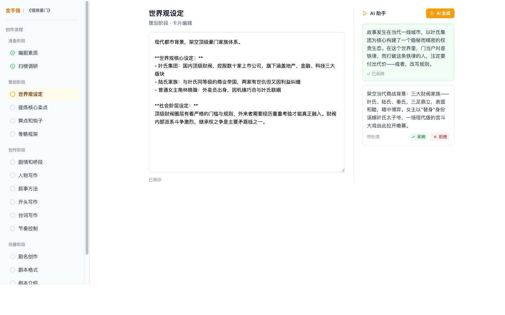
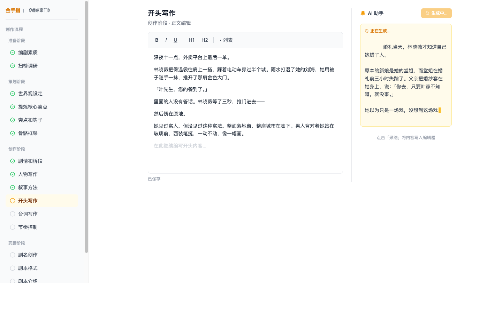

# 金手指 AI 编剧助手 — 前端成品预览

> 文档日期：2026-04-10
> 版本：MVP v0.1
> 技术栈：Next.js 16 · React 19 · Tailwind CSS v4 · TipTap 富文本编辑器

---

## 产品简介

**金手指** 是一款面向微短剧编剧的 AI 辅助创作平台，提供从市场调研到最终剧本的全流程工作台。平台将传统编剧流程拆解为 **16 个创作步骤**，每个步骤内置专属 AI 生成能力，帮助编剧快速产出高质量内容。

---

## 一、登录页

用户通过用户名/密码完成登录或注册。界面采用暖米色系背景，衬线字体品牌标识，风格素雅专业。

**设计要点：**
- 品牌色：琥珀金 `#C4956A`，呼应剧本、墨迹的文化调性
- 背景色：`#FDFBF7` 米白色，营造稳重感
- 支持登录 / 注册双态切换，无需跳转新页面

---

## 二、项目列表页

登录后进入「我的项目」，以卡片网格形式展示所有剧本项目，支持一键新建。

**功能说明：**
- 每个项目卡片展示：剧名、题材类型、当前状态（draft / in_progress / done）
- 当前进行中的项目高亮显示（橙色边框）
- 右上角「新建项目」按钮触发内联表单，输入标题和题材后立即创建
- 空状态引导文案：「还没有项目，点击「新建项目」开始创作」

---

## 三、创作工作台 — 策划阶段（世界观设定）

进入项目后，进入三栏式工作台界面：左侧步骤导航、中央编辑区、右侧 AI 助手面板。

**布局说明：**

| 区域 | 宽度 | 功能 |
|------|------|------|
| 左侧导航 | 256px | 16步骤树状导航，显示完成状态 |
| 中央编辑区 | flex-1 | 当前步骤的内容编辑器 |
| 右侧 AI 面板 | 288px | AI 生成候选内容、采纳/拒绝操作 |

**步骤导航层级：**
- ✅ 准备阶段：编剧素质、扫榜调研
- 🔵 策划阶段（当前）：世界观设定（激活）、提炼核心卖点、爽点和钩子、骨骼框架
- ⭕ 创作阶段：剧情和桥段、人物写作、叙事方法、开头写作、台词写作、节奏控制
- ⭕ 完善阶段：剧名创作、剧本格式、剧本介绍、版权证书

**AI 候选内容区：**
- 已采纳的内容以绿色背景显示
- 待处理候选支持「采纳」（写入编辑器）或「拒绝」操作
- 每次点击「AI 生成」触发后端 SSE 流式输出

---

## 四、创作工作台 — 创作阶段（开头写作 · 富文本模式）

富文本步骤（如开头写作、台词写作、剧本介绍）使用 TipTap 编辑器，支持格式工具栏。右侧 AI 面板实时展示流式生成内容。

**富文本功能：**
- 工具栏：加粗、斜体、下划线、H1/H2 标题、无序列表
- 实时自动保存（2秒防抖）
- 底部状态指示：「已保存」/ 「未保存的更改…」

**AI 流式生成体验：**
- 右侧面板显示「正在生成…」状态 + 打字机光标动效
- 生成完成后，用户点击「采纳」将内容注入编辑器光标位置
- 可同时保留多个候选，按需择优

---

## 五、整体 UI 规范

| 设计令牌 | 值 |
|---------|-----|
| 主色（琥珀金） | `#F59E0B` / Tailwind `amber-500` |
| 品牌深色 | `#C4956A` |
| 正文色 | `#111827` |
| 辅助文字 | `#6B7280` |
| 边框 | `#E5E7EB` |
| 背景 | `#F9FAFB` |
| 成功/已采纳 | `#ECFDF5` + `#BBF7D0` |
| 圆角 | `rounded-lg` (8px) |
| 字体 | System UI（正文）/ Noto Serif SC（品牌标题）|

---

## 六、技术实现亮点

1. **流式 AI 输出**：通过 SSE（Server-Sent Events）实现 AI 内容边生成边显示，减少等待感
2. **客户端状态管理**：Zustand store 分离步骤资产（`stepStore`）与项目列表（`projectStore`），离线状态下也可继续编辑
3. **自动保存**：`useAutoSave` Hook 监听内容变化，2秒防抖后自动提交至后端
4. **16步骤流程引擎**：步骤元数据统一配置，支持 `form / card / outline / richtext / analysis` 五种编辑器形态
5. **优雅降级**：后端不可用时自动创建本地 mock 项目，前端可独立演示

---

## 七、当前完成状态

| 模块 | 状态 |
|------|------|
| 登录 / 注册页 | ✅ 完成 |
| 项目列表页 | ✅ 完成 |
| 工作台三栏布局 | ✅ 完成 |
| 步骤导航（16步） | ✅ 完成 |
| 普通文本编辑器 | ✅ 完成 |
| 富文本编辑器（TipTap） | ✅ 完成 |
| AI 候选面板（采纳/拒绝） | ✅ 完成 |
| AI 流式生成 UI | ✅ 完成 |
| 自动保存指示器 | ✅ 完成 |
| 后端 API 对接 | 🔄 联调中 |
| 移动端适配 | ⏳ 待排期 |

---

*本文档由 FE-Dev Agent 自动生成，截图来源于本地 Next.js 开发服务器（localhost:3099）。*
