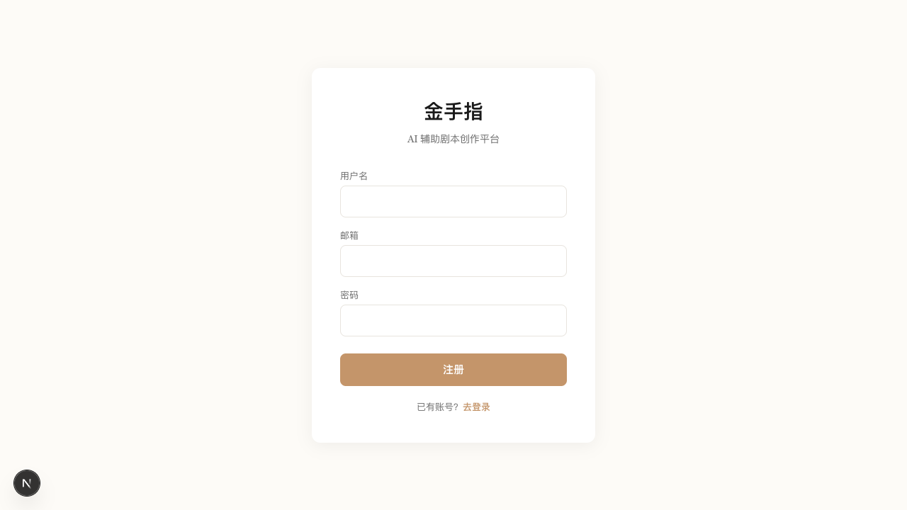
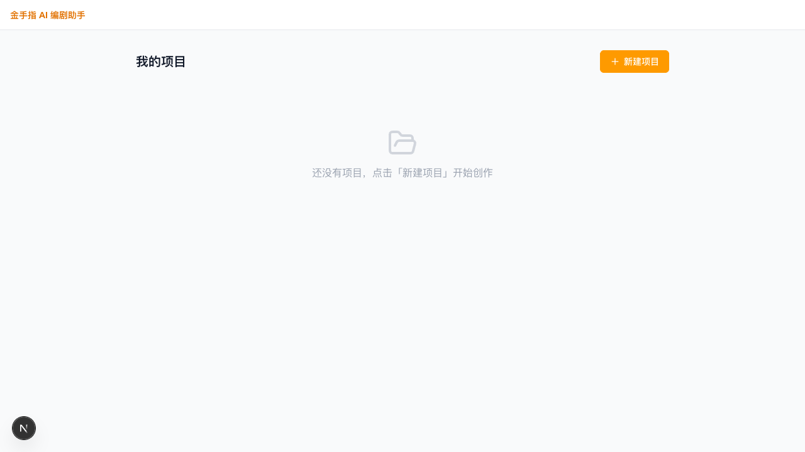
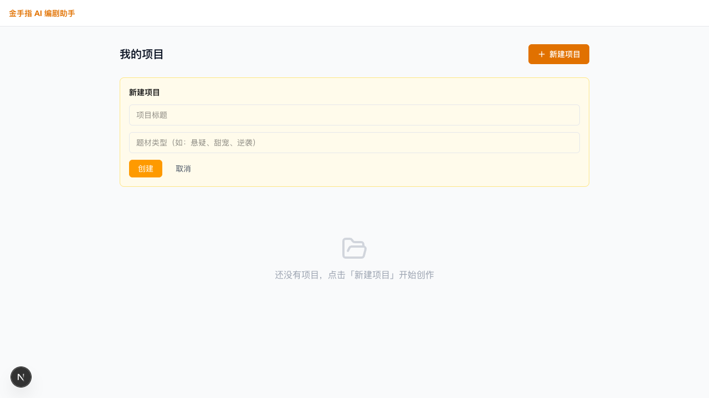
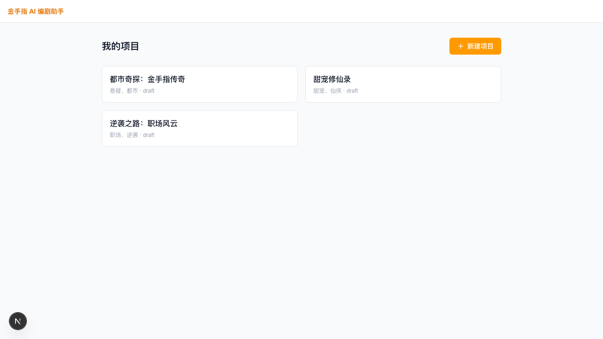
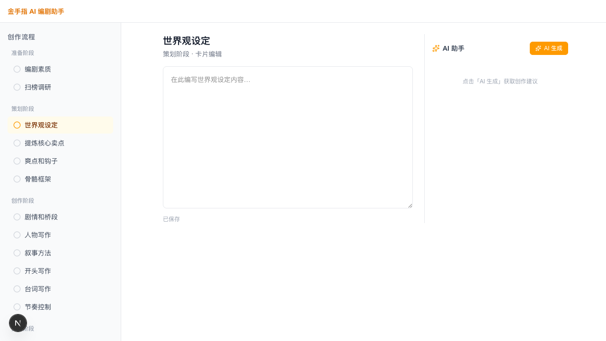
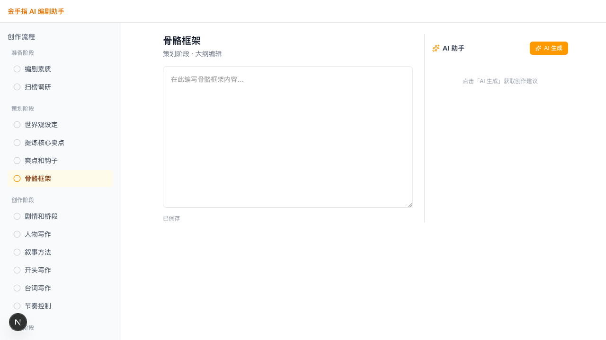

# 金手指 AI 编剧助手 — 前端界面预览

> 截图日期：2026-04-10
> 版本：MVP M2
> 技术栈：Next.js 16 · Tailwind CSS · Zustand · Tiptap

---

## 1. 登录页

用户打开产品后首先看到登录界面。界面采用暖色系设计风格（米白底色 `#FDFBF7`、金棕色主按钮 `#C4956A`），与"金手指"品牌调性一致。

**功能点：**
- 用户名 + 密码登录
- 点击「注册」切换注册表单（无页面跳转，原地切换）
- 登录后自动跳转至项目列表

---

## 2. 注册页（登录页内嵌）

注册与登录复用同一张卡片，通过状态切换呈现，减少用户跳转。

**功能点：**
- 用户名、邮箱、密码三字段
- 注册成功后自动登录并跳转
- 已有账号时一键切回登录

---

## 3. 项目列表页 — 空状态

首次进入时展示引导空状态，降低用户启动门槛。

**功能点：**
- 顶部导航栏品牌标识
- 右上角「新建项目」CTA 按钮
- 空状态图文引导

---

## 4. 新建项目弹出面板

点击「新建项目」后，在页面内展开创建表单（非弹窗），填写标题与题材类型后点击「创建」即进入工作台。

**功能点：**
- 项目标题（必填）
- 题材类型（如：悬疑、甜宠、逆袭，选填）
- 后端不可用时自动 fallback 本地 mock，流程不中断

---

## 5. 项目列表 — 有项目卡片

创建项目后，列表以 2 列 Grid 展示项目卡片，包含标题、题材与状态信息。

**功能点：**
- 2 列响应式网格布局
- 每个卡片显示标题 / 题材 / 状态
- 点击卡片直接进入对应步骤的工作台

---

## 6. 工作台编辑器 — 策划阶段·世界观设定

这是核心创作界面，采用三栏布局：

| 区域 | 说明 |
|------|------|
| 左侧导航 | 16 步创作流程，按「准备 → 策划 → 创作 → 完善」分段 |
| 中央编辑区 | 当前步骤的内容编辑器（富文本 / 纯文本依步骤而定） |
| 右侧 AI 助手 | 一键「AI 生成」触发流式内容，结果以候选卡片形式呈现 |

**功能点：**
- 左侧步骤导航，当前步骤高亮（橙色）
- 编辑器支持实时自动保存（显示「已保存」）
- 右侧 AI 助手面板，点击「AI 生成」触发 SSE 流式输出

---

## 7. 工作台编辑器 — 策划阶段·骨骼框架

点击左侧导航切换到不同步骤，中央内容区和标题随之更新，页面无刷新。

**功能点：**
- 步骤间无缝切换，URL 同步更新（`/projects/:id/steps/:step`）
- 步骤类型（卡片编辑 / 大纲编辑 / 剧本编辑）在副标题中标注
- 每步内容独立存储，互不干扰

---

## 技术说明

| 项目 | 说明 |
|------|------|
| 框架 | Next.js 16 (App Router + Turbopack) |
| 样式 | Tailwind CSS v4 |
| 状态管理 | Zustand（`projectStore` / `aiStore` / `stepStore`） |
| 编辑器 | Tiptap（富文本扩展） |
| AI 通信 | SSE 流式接口（`useSSE` hook + `useAIGenerate`） |
| 路由结构 | `/(workspace)/projects/[id]/steps/[step]` |

---

## 已知问题 & 修复

| 问题 | 状态 |
|------|------|
| `useAIGenerate` 中 `getSnapshot` 无限循环 bug（React 警告） | ✅ 已修复：提取 `EMPTY_CANDIDATES` 常量避免每次渲染创建新数组 |
| 后端未启动时项目列表空白 | ⚠️ 预期行为（后端需独立启动），前端已有 mock fallback |

---

*截图通过 Playwright CLI 自动化获取，运行于本地开发服务器（`npm run dev`，端口 3000）。*
