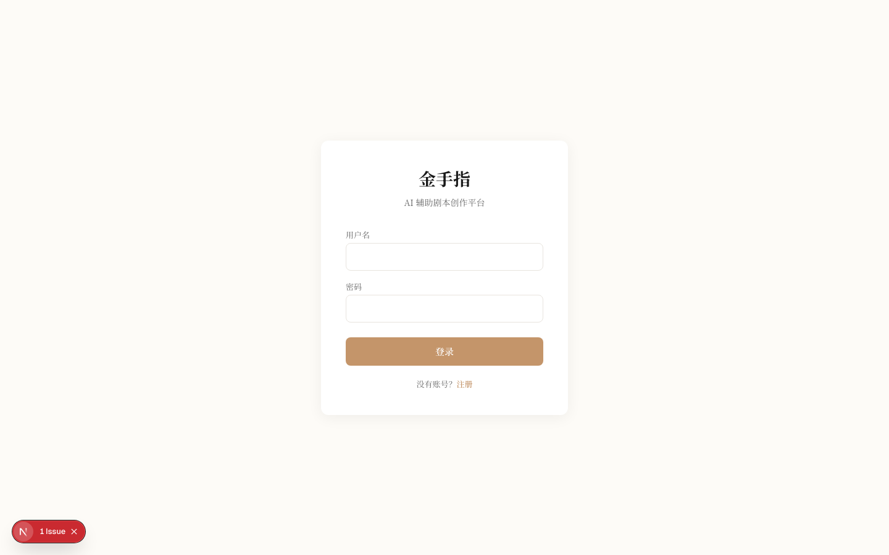
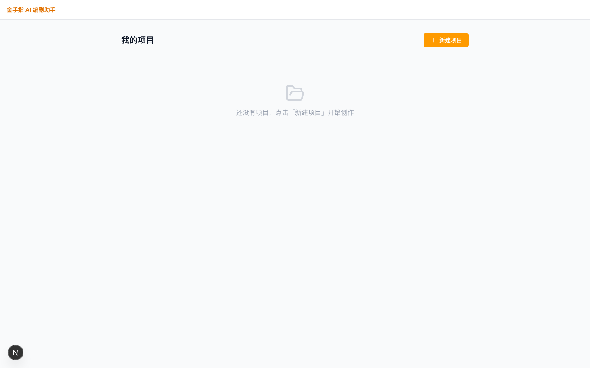
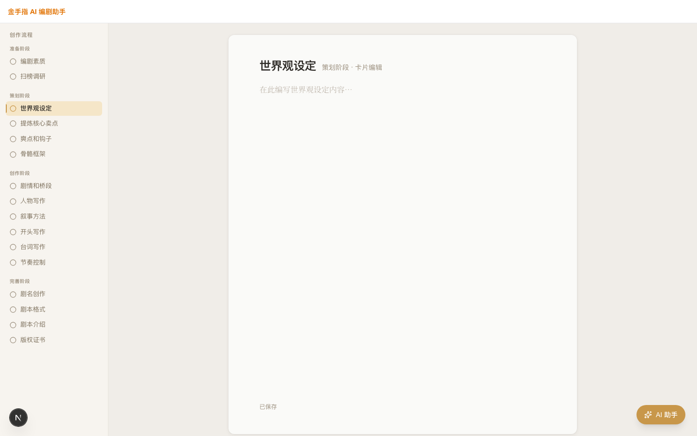
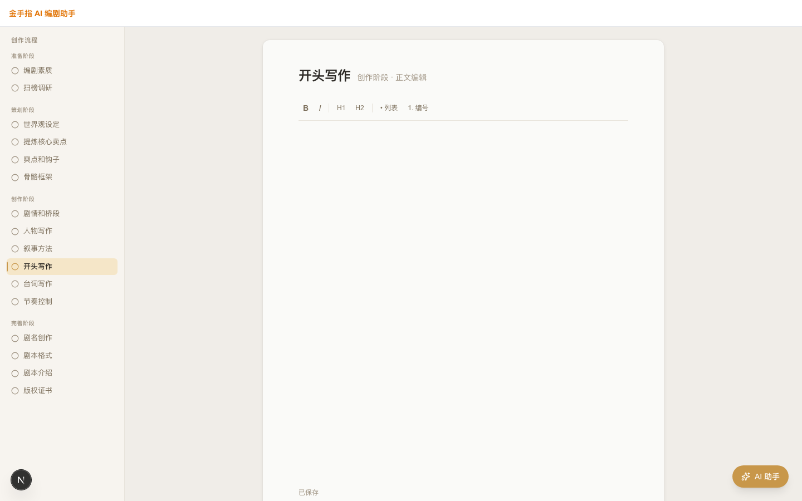
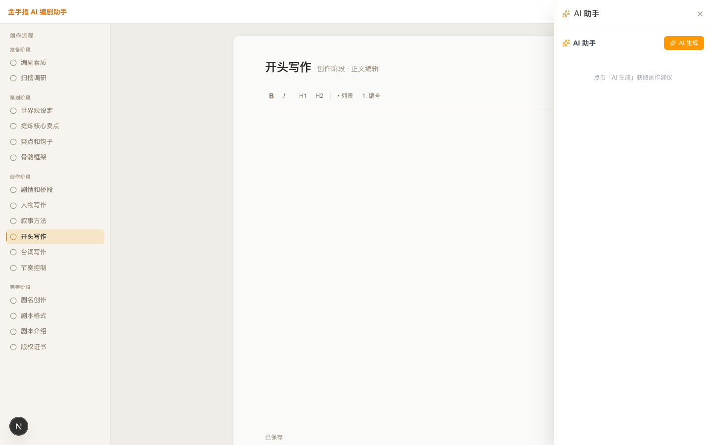

# 前端视觉效果预览 v2（改版后）

> **对应版本**：branch `agent/fe-dev/545477bc`，commit `99a3aba`
> **截图时间**：2026-04-10
> **改版依据**：`docs/visual-design-spec.md` v1.0

---

## 改版核心变化

| 改版前 | 改版后 |
|--------|--------|
| 白色背景，无层次 | 暖米色 Canvas + 白纸 Paper 双层背景 |
| 编辑区有边框，高度受限 | Paper 卡片悬浮，全视口高度，无边框 |
| AI 面板常驻右侧，挤压编辑区 | AI 面板改为右下角 FAB，按需展开 |
| 颜色随机（gray/amber 混用）| 统一暖棕色系（#C8974A 金色品牌色）|
| 导航宽 256px，无视觉层级 | 导航 224px，金色激活竖条，三态设计 |
| 系统默认字体 | Noto Serif SC 正文字体，有书写质感 |

---

## 页面截图

### 1. 登录页

**设计要点**：
- 背景 `#FDFBF7` 暖白，非纯白
- 品牌名「金手指」使用 Noto Serif SC，大气
- 按钮色 `#C4956A` 暖金色，非标准 amber
- 卡片投影轻柔，无厚重边框

---

### 2. 项目列表

**当前状态**：空列表态
**待优化**：页面背景色尚未切换到暖灰 `#F0EDE8`（待 FE 更新）

---

### 3. 工作台 — 世界观设定（卡片编辑模式）

**设计要点**：
- Canvas 背景 `#F0EDE8` 暖灰书桌色
- Paper 卡片居中（max-w 720px），白纸悬浮投影效果
- 左侧导航：准备/策划/创作/完善 四阶段清晰分组
- 激活步骤「世界观设定」：金色 `#F5E6C8` 背景 + 左侧 2px 金竖条
- AI 助手按钮：右下角固定 FAB（金色，不占编辑区）

---

### 4. 工作台 — 开头写作（富文本编辑模式）

**设计要点**：
- 富文本工具栏内嵌于 Paper 内部（B / I / H1 / H2 / 列表 / 编号）
- 工具栏分隔线颜色 `#E8E4DC`，与整体暖色系统一
- 编辑区高度全视口，创作者不会感到压迫

---

### 5. AI 助手面板（展开态）

**设计要点**：
- 点击 FAB 后从右侧滑出抽屉（w-80）
- 编辑区仍然可见，不被完全遮盖
- AI 生成按钮使用品牌金色

---

## 与 Laper 的差距评估

| 维度 | 当前状态 | Laper | 差距 |
|------|---------|-------|------|
| 编辑区沉浸感 | Paper 卡片，较好 | 全屏白纸，无边界 | 小 |
| 暖色调统一性 | 工作台已统一，项目页待更新 | 全站统一 | 中 |
| 导航图标 | 纯文字 | 图标+文字 | 中（P2）|
| 剧本格式工具栏 | 通用格式（B/I/H1） | 专业剧本格式（场次/对话/角色）| 中（P2）|
| 内容有数据时效果 | 待后端联调验证 | 丰富内容填充 | 待验 |

